# LAMBKIN

## Overview

LAMBKIN (Localization And Mapping Benchmarking) is a programmatic SDK for building reproducible, structured, and parallelized SLAM evaluation pipelines.
It moves away from complex automation "glue" in favor of a clean, Python-first approach to benchmarking.


### Scope

Lambkin is a simple, sequential process orchestrator that covers the basic concepts of process lifecycle management and graceful termination for ROS2-based benchmarking pipelines. It handles each stage of a benchmark run in a strictly ordered sequence — spawning nodes, recording topics, synchronizing playback, and collecting evaluation metrics — making the execution flow explicit and easy to follow.

While Lambkin is algorithm-agnostic by design and can integrate with any ROS2-based pipeline, this repository provides a specific worked example using the [Beluga](https://github.com/Ekumen-OS/beluga) AMCL localization algorithm, including a predefined launch file and configuration files to run a complete benchmark out of the box.


## Architecture

### How it works

Each benchmark iteration follows this sequence:

``` mermaid
flowchart TD

    START(( )) --> A

    A["<b>1. Clean up orphaned ROS2 nodes</b><br>pkill -f ros2 · pkill -f rviz2<br>Kill leftover processes from previous runs"]
    B["<b>2. Launch Beluga Algorithm</b><br>ros2 launch beluga_amcl ...<br>beluga_amcl · map_server · lifecycle_manager"]
    C["<b>3. Start Recording Topics</b><br>ros2 bag record /pose /tf /tf_static"]
    D["<b>4. Play Reference Rosbag</b><br>ros2 bag play reference.bag<br>Publishes sensor data into live ROS2 graph"]
    E["<b>5. Wait for Playback to End</b><br>wait $BAG_PID<br>Synchronizes all process termination"]
    F["<b>6. Clean up All ROS2 Nodes</b><br>kill $LAUNCH_PID $RECORD_PID<br>Kill all processes before next iteration"]
    G["<b>7. Evaluate Results</b><br>evo_traj tum ... · evo_ape tum ...<br>TUM format conversion · APE metrics"]
    H["<b>8. Generate Aggregated Plots</b><br>evo_res results/*.zip --plot<br>APE comparison plots across all configurations"]

    END(( ))

    A --> B --> C --> D --> E --> F --> G --> H

    style START fill:#111827,stroke:#111827
    style END   fill:#111827,stroke:#111827

    style A fill:#fee2e2,stroke:#dc2626,color:#7f1d1d
    style B fill:#dbeafe,stroke:#2563eb,color:#1e3a8a
    style C fill:#dcfce7,stroke:#16a34a,color:#14532d
    style D fill:#fef3c7,stroke:#d97706,color:#78350f
    style E fill:#f3f4f6,stroke:#6b7280,color:#1f2937
    style F fill:#fee2e2,stroke:#dc2626,color:#7f1d1d
    style G fill:#ede9fe,stroke:#7c3aed,color:#4c1d95
    style H fill:#ede9fe,stroke:#7c3aed,color:#4c1d95
```




### ROS2 Package

LAMBKIN is designed to work with any localization algorithm package.
The provided launch file brings up three ROS2 nodes:

- **Beluga AMCL** — the algorithm being benchmarked (e.g. a AMCL-based node), responsible for estimating the robot pose from sensor data and a known map.
- **map_server** — provides the static map to the localization node
- **lifecycle_manager** — manages the lifecycle of both the localization node and map_server, handling their startup and shutdown transitions automatically

These three nodes are launched together via a ROS2 launch file, which accepts parameters such as the map path, sensor model type, and maximum number of
particles, allowing LAMBKIN to evaluate different configurations automatically.

### Output folder structure

Lambkin automatically creates the following directory structure for all generated artifacts:

```
benchmarking_results/
└── <sensor_model>_p<num_particles>/
    └── iter_<number>/
        ├── bag/        ← Recorded rosbags
        ├── tum/        ← TUM trajectory files
        └── ape/        ← APE metrics and zip results
└── plots_ape/          ← Aggregated APE plots across all configurations
```

---

## Installation

### Prerequisites

Make sure you have the following installed:

- [Docker](https://docs.docker.com/get-docker/) and [Docker Compose](https://docs.docker.com/compose/)


### Expected artifacts

Make sure you have the following reference files available before running the benchmark:

| Artifact | Description |
|---|---|
| Rosbag | Reference sensor data to replay during the benchmark |
| Map | Static map file in `.yaml` and `.pgm` format |
| Groundtruth | Reference trajectory in `.tum` format to evaluate against |

### Setup

**1. Build and start the Docker container:**

```bash
docker compose up -d lambkin_dev
docker compose exec -it lambkin_dev bash
```

**2. Install ROS2 dependencies:**

```bash
rosdep install --from-paths lambkin_ros2 --ignore-src -r -y
```

**3. Install Python dependencies:**

```bash
uv sync
```

**4. Build the workspace:**

```bash
colcon build --symlink-install
source install/setup.bash
```

---

## Configuration

All benchmark parameters are defined as constants at the top of `src/lambkin/lambkin.py`:

| Parameter | Default | Description |
|---|---|---|
| `REFERENCE_BAG_PATH` | `/rosbags/reference/hq_files/hq_simulation_segment_0` | Path to the reference rosbag |
| `REFERENCE_MAP_PATH` | `/rosbags/reference/hq_files/map.yaml` | Path to the map file |
| `REFERENCE_TUM_PATH` | `/rosbags/reference/hq_files/groundtruth.tum` | Path to the ground truth TUM file |
| `LASER_MODELS` | `["likelihood_field", "beam"]` | Sensor models to evaluate |
| `NUM_PARTICLES` | `[1, 10, 1000, 2000]` | Particle counts to evaluate |
| `NUM_ITERATIONS` | `1` | Number of iterations per configuration |
| `RATE` | `1` | Rosbag playback rate |
| `QOS_FILE_PATH` | `/rosbags/reference/qos_override.yaml` | QoS profile overrides file |
| `RESULTS_PATH` | `/benchmarking_results` | Root output directory |
| `DRY_MODE` | `False` | If `True`, prints commands without executing them |
| `BELUGA_READY_DELAY` | `3` | Seconds to wait for Beluga to initialize |
| `PROCESS_TERMINATION_TIMEOUT` | `7.0` | Seconds before force-killing a process |

The benchmark will automatically run **all combinations** of `LASER_MODELS` × `NUM_PARTICLES` × `NUM_ITERATIONS`.

---

## Usage

### Running the benchmark

```bash
uv run src/lambkin/lambkin.py
```

### Dry mode

To preview all commands without executing them, set `DRY_MODE = True` in `src/lambkin/lambkin.py`:

```python
DRY_MODE = True
```

Then run normally — it will print all commands to stdout without launching any processes.

### Interpreting results

After the benchmark completes:

- **APE metrics** are saved as `.zip` files under each `iter_<n>/ape/` directory
- **TUM trajectories** are saved under each `iter_<n>/tum/` directory
- **Aggregated APE plots** comparing all configurations are saved under `benchmarking_results/plots_ape/`

The APE (Absolute Pose Error) metric measures the difference between the estimated trajectory and the ground truth. Lower APE values indicate better localization accuracy.

## Example Results

Plot generated after running the benchmark with all configurations.


---

## Known Bags

- Improve process management to reliably terminate all ROS2 child processes across iterations
- Fix orphaned processes that survive after a crashed run and another iteration
- Fix tight_layout warning in evo_res plots and overlapping axis labels

        ```
        /ws/.venv/lib/python3.12/site-packages/seaborn/axisgrid.py:123: UserWarning: The figure layout has changed to tight self._figure.tight_layout
        (*args **kwargs)
        ```
