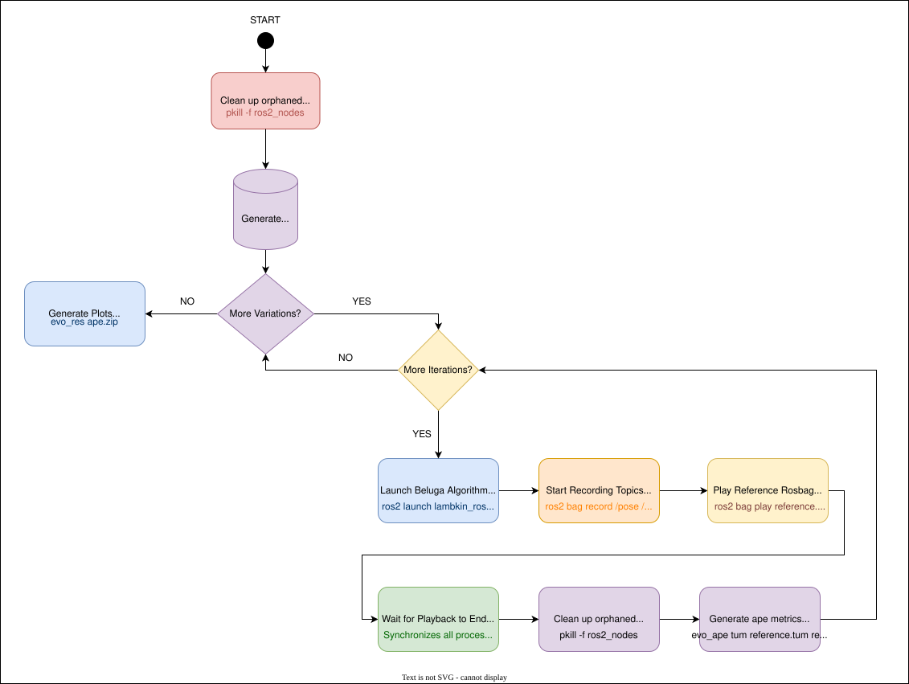
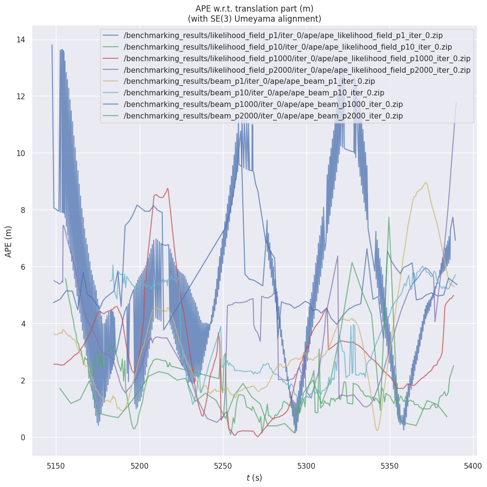

# LAMBKIN

## Overview

LAMBKIN (Localization And Mapping Benchmarking) is a programmatic SDK for building reproducible, structured, and parallelized SLAM evaluation pipelines.
It moves away from complex automation "glue" in favor of a clean, Python-first approach to benchmarking.


## Scope

In its current phase, LAMBKIN acts as a sequential process orchestrator. It provides a streamlined, Python-first approach to the fundamental lifecycle management of ROS2-based benchmarking through strictly ordered execution, synchronized playback, and graceful termination of distributed nodes.

The logic handles node lifecycle management to ensure a clean ROS2 graph between iterations, synchronizes data flow between bag playback and node processing, and automates evaluation by interfacing with tools like evo to transform raw logs into standardized metrics.

## ROS2 Beluga Example

While Lambkin is algorithm-agnostic by design and can integrate with any localization package, this repository provides a specific worked example using [Beluga](https://github.com/Ekumen-OS/beluga) AMCL. It includes a ROS2 package with a launch file and a configuration file ready to run a complete benchmark out of the box.

To simplify deployment, the repository provides a dockerized setup (see [docker](docker/) folder) that includes all necessary dependencies and tools pre-configured for immediate use.

The provided launch file brings up three ROS2 nodes:

- **`beluga_amcl`** — Particle filter-based AMCL node, responsible for estimating the robot pose from sensor data and a known map.
- **`map_server`** — Loads a static occupancy grid from disk and provides the static map to the localization node.
- **`lifecycle_manager`** — Manages the lifecycle transitions (`configure` → `activate`→ `deactivate` → `cleanup`) of both the localization node and `map_server`, handling their startup and shutdown ordering automatically.

The launch file accepts parameters such as the map path, sensor model type, and maximum number of particles, allowing Lambkin to sweep different configurations automatically.

* For more details on the default configuration, see the [configuration file](https://ekumen-os.github.io/beluga/packages/beluga_amcl/docs/ros2-reference.html).

## Architecture

This design describes the architecture of the Lambkin Python library.

### How it works

The following diagram illustrates the full benchmarking execution flow:



### Output folder structure

Lambkin automatically creates the following directory structure for all generated artifacts:

```
benchmarking_results/
└── <sensor_model>_p<num_particles>/
    └── iter_<number>/
        ├── bag/        ← Recorded rosbags
        ├── tum/        ← TUM trajectory files
        └── ape/        ← APE metrics and zip results
└── plots_ape/          ← Aggregated APE plots across all configurations
```

---

## Installation

### Prerequisites

Make sure you have the following installed:

- [Docker](https://docs.docker.com/get-docker/) and [Docker Compose](https://docs.docker.com/compose/)


### Expected artifacts

Make sure you have the following reference files available before running the benchmark:

| Artifact | Description |
|---|---|
| Rosbag | Reference sensor data to replay during the benchmark |
| Map | Static map file in `.yaml` and `.pgm` format |
| Groundtruth | Reference trajectory in `.tum` format to evaluate against |

### Setup

**1. Build and start the Docker container:**

```bash
docker compose up -d lambkin_dev
docker compose exec -it lambkin_dev bash
```

**2. Install ROS2 dependencies:**

```bash
rosdep install --from-paths lambkin_ros2 --ignore-src -r -y
```

**3. Install Python dependencies:**

```bash
uv sync
```

**4. Build the workspace:**

```bash
colcon build --symlink-install
source install/setup.bash
```

---

## Configuration

All benchmark parameters are defined as constants at the top of `src/lambkin/lambkin.py`:

| Parameter | Default | Description |
|---|---|---|
| `REFERENCE_BAG_PATH` | `/rosbags/reference/hq_files/hq_simulation_segment_0` | Path to the reference rosbag |
| `REFERENCE_MAP_PATH` | `/rosbags/reference/hq_files/map.yaml` | Path to the map file |
| `REFERENCE_TUM_PATH` | `/rosbags/reference/hq_files/groundtruth.tum` | Path to the ground truth TUM file |
| `LASER_MODELS` | `["likelihood_field", "beam"]` | Sensor models to evaluate |
| `NUM_PARTICLES` | `[1, 10, 1000, 2000]` | Particle counts to evaluate |
| `NUM_ITERATIONS` | `1` | Number of iterations per configuration |
| `RATE` | `1` | Rosbag playback rate |
| `QOS_FILE_PATH` | `/rosbags/reference/qos_override.yaml` | QoS profile overrides file |
| `RESULTS_PATH` | `/benchmarking_results` | Root output directory |
| `DRY_MODE` | `False` | If `True`, prints commands without executing them |
| `BELUGA_READY_DELAY` | `3` | Seconds to wait for Beluga to initialize |
| `PROCESS_TERMINATION_TIMEOUT` | `7.0` | Seconds before force-killing a process |

The benchmark will automatically run **all combinations** of `LASER_MODELS` × `NUM_PARTICLES` × `NUM_ITERATIONS`.

---

## Usage

### Running the benchmark

```bash
uv run src/lambkin/lambkin.py
```

### Dry mode

To preview all commands without executing them, set `DRY_MODE = True` in `src/lambkin/lambkin.py`:

```python
DRY_MODE = True
```

Then run normally — it will print all commands to stdout without launching any processes.

### Interpreting results

After the benchmark completes:

- **APE metrics** are saved as `.zip` files under each `iter_<n>/ape/` directory
- **TUM trajectories** are saved under each `iter_<n>/tum/` directory
- **Aggregated APE plots** comparing all configurations are saved under `benchmarking_results/plots_ape/`

The APE (Absolute Pose Error) metric measures the difference between the estimated trajectory and the ground truth. Lower APE values indicate better localization accuracy.

## Example Results

Plot generated after running the benchmark with all configurations.



---

## Known Bugs

- Improve process management to reliably terminate all ROS2 child processes across iterations
- Fix orphaned processes that survive after a crashed run and another iteration
- Fix tight_layout warning in evo_res plots and overlapping axis labels

```Bash
/ws/.venv/lib/python3.12/site-packages/seaborn/axisgrid.py:123: UserWarning: The figure layout has changed to tight self._figure.tight_layout (*args **kwargs)
```
