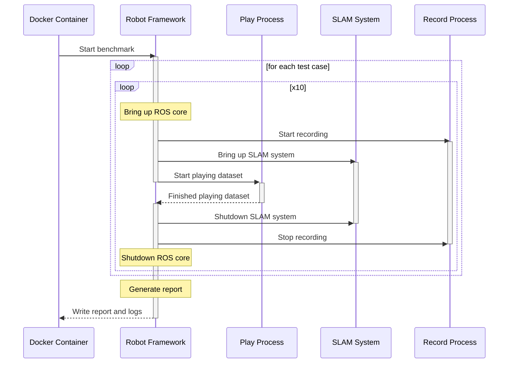

# Architecture

The packages found in LAMBKIN fall into one of these three categories:

- [Core packages](../src/core) (e.g. `lambkin-shepherd`) with common tools shared by all benchmarks.
- [Tool packages](../src/tools) not needed during benchmarking (i.e. dataset format convertion tools).
- [Benchmark packages](../src/benchmarks) that target a specific SLAM system (i.e. Cartographer ROS, SLAM Toolbox).

TBD

## Benchmark sequence diagram

The following diagram shows a typical SLAM benchmark running inside a docker container:

